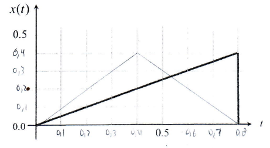
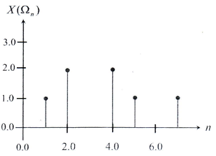

## Soal 1
(Nilai 20, *Outcome* : kemampuan menerapkan teknik (matematik) pengolahan sinyal diskrit (*Discrete Convolution and Correlation*))

Diberikan dua vektor sinyal diskrit, berturut-turut $\bar{x}(k)=(1.5\ -1.5\ 1.5\ -1.5\ 1.5\ -1.5\)^T$ dan $\bar{y}(k)=(-1.0\ 0.5\ -1.0\ 0.5\ -1.0\ 0.5\)^T$.

1. Hitung dan lukiskan konvolusi *cyclic* $h_{xy}(k)$.
2. Turunkan formula perkalian vektor korelasi silang antara kedua sinyal diskrit, kemudiam hitung dan lukiskan 5 komponen pertama dari fungsi korelasi silang $r_{xy}(k)$ dari kedua sinyal yang diberikan.

## Soal 2
(Nilai 20, *Outcome* : kemampuan melakukan disain filter digital jika diberikan model spesifikasi filter (*digital filter*))

Diberikan respons frekuensi diskrit sebuah filter digital *low-pass*, LPF, sebagaimana dilukiskan pada gambar berikut, di mana $\omega_s$ adalah frekuensi *sampling*. Cari respons impuls digital $h(k)$ jika order filter adalah 5. Tuliskan fungsi transfer filter dalam domain z. Kemudian, tuliskan persamaan diferens (*difference equation*) dari filter digital yang diperoleh. Dalam hal ini diberikan periode *sampling* adalah 0.1 sec.

## Soal 3
(Nilai 20, *Outcome* : kemampuan menggunakan tool pengolahan sinyal diskrit (*Discrete Fourier Transform*))

Diberikan sinyal diskrit $x(k),\ k=0,\dots ,7$ dari sinyal kontinyu sebagaimana dilukiskan pada gambar berikut. Periode sampling sinyal adalah 0.1 sec. Tuliskan formula matriks dari DFT, kemudian hitung 3 komponen pertama $X(\Omega)$ jika digunakan *window*segitiga $w(k)$.

## Soal 4
(Nilai 20, *Outcome* : memahami dan menunjukkan kemampuan menggunakan tool pengolahan sinyal diskrit (*Fast Fourier Transform*))

1. Turunkan dan gambarkan algoritma FFT (*Fast Fourier Transform*) *decimation-in-time* (algoritma *butterfly*) untuk data 8 poin.
2. Dari gambar yang didapat pada (1), tuliskan formula perkalian vektor guna mencari IFFT (*Inverse Fast Fourier Transform*), kemudian cari elemen sinyal (*sampled signal*) diskrit x(3) jika diberikan spektral diskrit pada gambar berikut.

## Soal 5
(Nilai 20, *Outcome* : memahami teknik analisis frekuensi sinyal (*analisis spektral*))

Diberikan sinyal diskrit $x(k),\ k=0,\ N-1$. Kemukakan langkah-langkah guna menghitung spektral suatu sinyal diskrit tersebut dengan menggunakan *average periodogram* metoda *Welch*. Lengkapi jawaban Saudara mengenai faktor-faktor yang menentukan keberlakuan teknik *average periodogram* tersebut, serta faktor-faktor yang menentukan resolusi frekuensi dari spektral yang diperoleh. Lengkapi dengan gambar guna menjelaskan maksud Saudara.