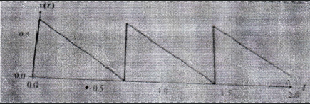

## Soal 1 (Nilai 15, menguji *program outcome* A)

Terangkan dengan singkat dan jelas terminologi berikut ini

1. Sinyal
2. Konverter Analog ke Dijital
3. Sistem waktu diskrit
4. Sinyal dijital
5. Sistem Linier Waktu Invarian Kausal
6. Teorema Parseval
7. Deret Fourier

## Soal 2 (Nilai 25, menguji *program outcome* K)

Diketahui span instrumen pengukuran temperatur $300^o$ C dan zero dari rentangnya $100^o$ C dikonversi menjadi sinyal pengukuran elektrik 4-20 mA.

1. Jika transmitter mengirimkan sinyal 9 mA, maka tentukan nilai temperatur yang diukur?
2. Sinyal yang ditransmisikan diubah menjadi sinyal dijital menggunakan A/D 8 bit menggunakan konversi unipolar 1-10 V DC. Berapakah nilai dalam bilangan biner dan nilai desimal dalam rentang 8 bit terkait di dalam pengolah dijital?
3. Jika diinginkan resolusi $\Delta = 0.1^o$ C, berapakah bit A/D yang diperlukan untuk memenuhi spesifikasi ini?

## Soal 3 (Nilai 25, menguji *program outcome* A, K, E)

Diberikan model sinyal berikut:

$$
  x(t) = 2.5\cos(200\pi t + \frac{\pi}{2}) + 1.5\cos(240\pi t - \frac{\pi}{4})\sin(100\pi)
$$

Cari komponen-komponen sinyal x(t) dan kemudian lukiskan plot frekuensi (time spektral) dari sinyal x(t).

## Soal 4 (Nilai 25, menguji *program outcome* A, E)

Diberikan sinyal *sawtooth* sebagaimana ditunjukkan pada gambar berikut:

Cari vektor sinyal dan hitung matriks frekuensi jika perioda sampling adalah 0.1 detik. Kemudian dengan DFT cari komponen frekuensi $X(5\Omega)$ dari sinyal.

## Soal 5 (Nilai 10, menguji *program outcome* A,E)

Diberikan fungsi alih suatu FIR filter berikut:

$$
  H(z^{-1})=\frac{1}{5}(1-z^{-1})^2(1-0.5z^{-1})^3
$$

1. Tentukan apakah filter ini stabil? Berikan alasannya.
2. Buatlah diagram bloknya.