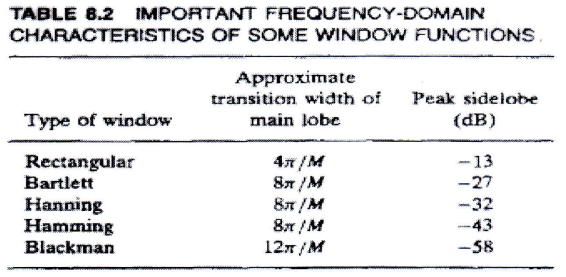
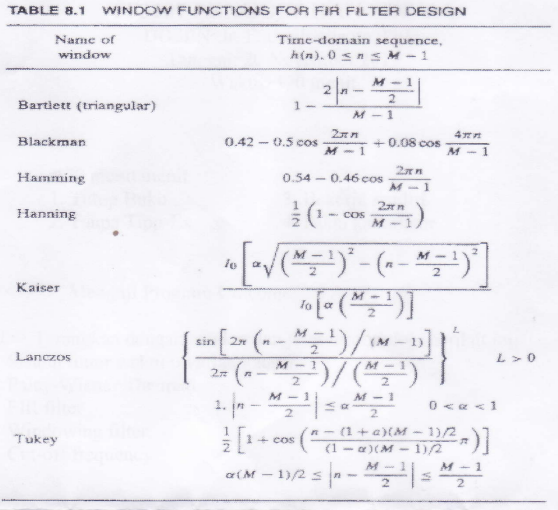

## Soal 1 (Nilai 15, menguji *program outcome* A)

Terangkan dengan singkat dan jelas terminologi berikut ini:

1. Sistem linier waktu invarian kausal
2. Teorema Paley-Wiener
3. Filter FIR
4. Windowing filter
5. *Cut-off frequency*

## Soal 2 (Nilai 20, menguji *program outcome* A, K, E) 

Diberikan sinyal $x(t)=2+4\cos(2\pi t) + 2\cos(2\pi t) + 3\cos(3\pi t) + 2\cos(4\pi t)$ dengan t dalam milidetik

1. Tentukan laju sampling minimum yang tidak akan menimbulkan efek aliasing.
2. Tentukan sinyal $x_a(t)$ yang akan teralias oleh x(t) karena waktu sampling (cacah) setengah dari frekuensi Nyquist nya.

## Soal 3 (Nilai 30, menguji *program outcome* A, K, E) 

Rancang filter yang memiliki spesifikasi:

- Pass band 0-4 kHz
- Stop band > 8 kHz
- atenuasi di sekitar -40 dB
- *sampling frequency* 80 kHz

1. Dengan menggunakan window yang sesuai (ambil orde filter ganjil terdekat), tentukan persamaan impuls respon filter.
2. Tentukan persamaan respon impuls filter kausal.
3. Buat diagram blok filter sesuai dengan nilai paramternya dengan hanya menampilkan 3 koefisien pertama dan 3 koefisien terakhir dan koefisien lain dengan tanda (...)
4. Tentukan berapa data yang diperlukan agar didapatkan minimum 30 data respon *steady state* untuk analisis pengolahan sinyal.

## Soal 4 (Nilai 15, menguji *program outcome* A, E)

Diberikan fungsi alih suatu FIR Filter berikut:
$$
  H(z^{-1}) = \frac{1}{5}(1-z^{-1})^2(1-0.25z^{-1})^2
$$

1. Tentukan apakah filter stabil? Berikan alasannya.
2. Buatlah diagram blok dalam bentuk direct form.
3. Tentukan respon terhadap masukan x(n) = {1 2 3 3 4 4 4  1 2 3 3 1}.

## Soal 5 (Nilai 20, menguji *program outcome* A, E)

Rancang suatu filter dijital High Pass FIR linear phase yang mendekati respon frekuensi ideal dengan menggunakan hasil dari filter pada soal nomor 3.

1. Tentukan koefisien dari filter seperti nomor 3.
2. Tuliskan persamaan filternya.

