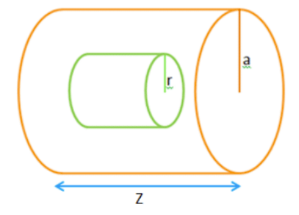
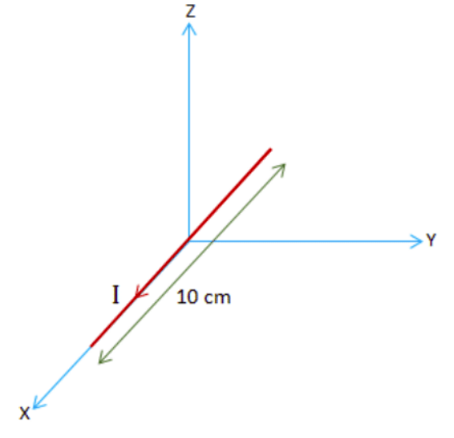
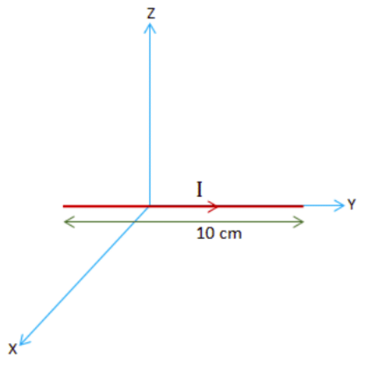
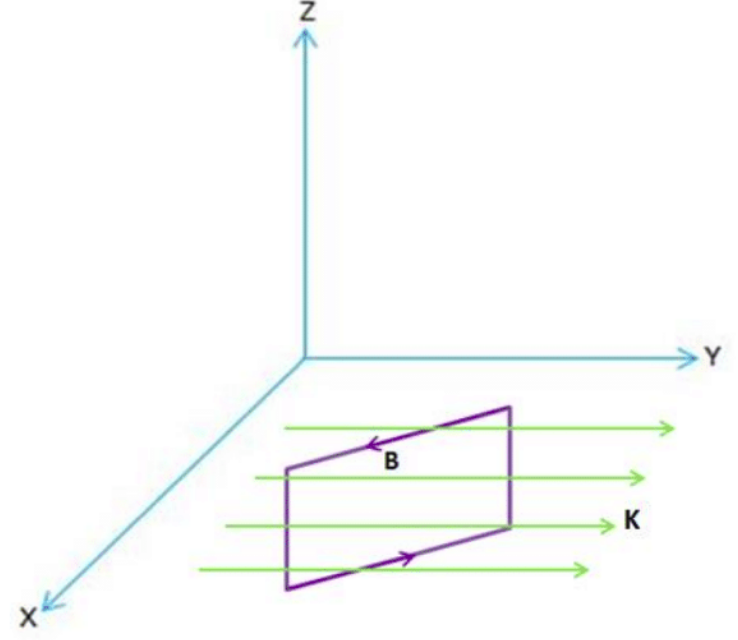
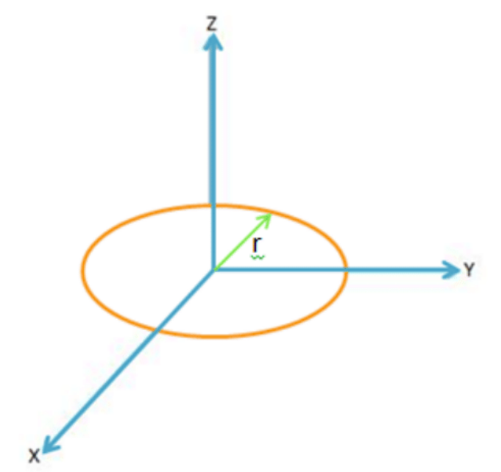
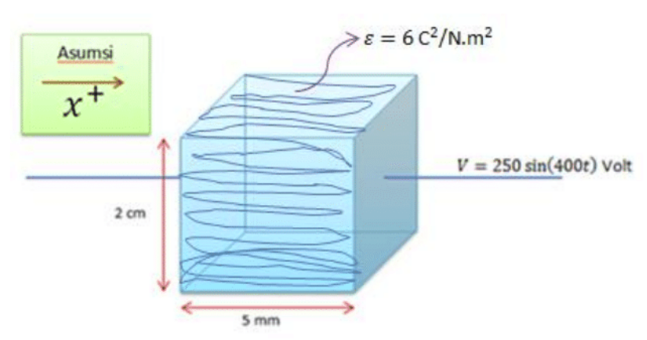

#Soal 1.
Dengan menggunakan hukum Gauss, carilah ekspresi $\mathbf D$ dan $\mathbf E$ di dalam dan di luar suatu silinder panjang tak hingga dengan jari-jari $a$ dan rapat muatan $\rho = r^2$ coulomb per meter kubik dimana $0\leq r\leq a$

#Soal 2.
Sebuah kawat dengan panjang 10 cm sejajar sumbu $x$ dan dialiri arus dc sebesar 2 Ampere dalam arah $+x$. Gaya yang bekerja pada kawat ini akibat suatu medan magnet $\mathbf B$ adalah $3\hat y+ 2\hat z$ Newton. Jika kawat ini diputar sehingga sejajar sumbu $y$ pada arah arus $+y$ maka gaya yang bekerja pada kawat tersebut menjadi $-3\hat x - 2\hat z$ Newton. Tentukanlah medan magnet $\mathbf B$ tersebut.

#Soal 3.
Diketahui suatu distribusi arus permukaan yang melebar tak hingga di bidang $z=0$ dengan rapat arus sebesar $\mathbf K = 10\hat y$ Ampere per meter. Hitunglah medan magnet di atas dan di bawah permukaan tersebut.

#Soal 4.
Suatu kawat penghantar dengan hambatan $5\Omega$ dibentuk menjadi suatu lingkaran dengan jar-jari $0.1$ meter pada bidang $z=0$. Jika diberikan medan magnet $\mathbf B = 0.2\  cos(10^3t)(\hat y+\hat z)$ Tesla, tentukan:
1. GGL induksi pada lingkaran kawat tersebut
2. Arus pada lingkaran kawat tersebut

#Soal 4.
Suatu kapasitor terdiri atas sepasang plat dengan jarak antar plat 5 mm. Plat berbentuk persegi dengan panjang sisi 2 cm. Di antara dua plat diselipkan bahan dielektrik dengan $\epsilon = 6\ \frac{C^2}{N.m^2}$. Tegangan pada kapasitor berubah terhadap waktu mengikuti fungsi $250\ sin(400t)$ Volt.
1. Tentukan medan listrik $\mathbf E$ di antara kedua plat. (Asumsikan medan listrik seragam dan abaikan efek tepian).
2. Tentukan medan $\mathbf D$
3. Tentukan rapat arus pergeseran $\mathbf J_d$
4. Tunjukkan bahwa arus konduksi $I_c$ pada kapasitor adalah $I_c = C\frac{dV}{dt}$(Petunjuk: Ingat relasi $Q=CV$).
5. Bandingkan nilai arus pergeseran $I_d$ dan arus konduksi $I_c$, apa kesimpulan anda?
---

#Solusi 1

<b>Gambar (1)</b>

Ekspresi ***D*** di dalam silinder
$\oint \mathbf{D}.d\mathbf{a} = Q_{f,enc}$
$\oint \mathbf{D}.d\mathbf{a} = \int \rho\ dV$
$\mathbf D (2\pi r z) = \int r^2(r\ dr\ d\phi\ dz)$
$\mathbf D (2\pi r z) = \int_{0}^{r} r^3 dr\int_{0}^{2\pi}d\phi \int_{0}^{z}dz $
$\mathbf D (2\pi r z) = \frac{1}{4} r^4 2\pi z$
$\mathbf D = \frac{1}{4} r^3 \mathbf{\hat r}$

Ekspresi ***E*** di dalam silinder
$\mathbf D = \epsilon_0 \mathbf E$
$\mathbf E = \frac{\mathbf D}{\epsilon_0}$
$\mathbf E = \frac{1}{4\epsilon_0}r^3 \mathbf{\hat r}$

Ekspresi ***D*** di luar silinder
$\oint \mathbf{D}.d\mathbf{a} = Q_{f,enc}$
$\oint \mathbf{D}.d\mathbf{a} = \int \rho\ dV$
$\mathbf D (2\pi r z) = \int r^2(r\ dr\ d\phi\ dz)$
$\mathbf D (2\pi r z) = \int_{0}^{a} r^3 dr\int_{0}^{2\pi}d\phi \int_{0}^{z}dz $
$\mathbf D (2\pi r z) = \frac{1}{4} a^4 2\pi z$
$\mathbf D = \frac{1}{4r} a^4 \mathbf{\hat r}$

Ekspresi ***E*** di luar silinder
$\mathbf E = \frac{\mathbf D}{\epsilon_0}$
$\mathbf E = \frac{1}{4r\epsilon_0}a^4\mathbf{\hat r}$
> anonim

#Solusi 2
Sebelum kawat diputar

<b>Gambar (2a)</b>

Medan magnet ***B***
$\mathbf F = \int_{0}^{l}(\mathbf I \times \mathbf B)dl$
$\mathbf F = \int_{0}^{0.1}(2\hat x \times \mathbf B)dl$
$3 \hat y + 2 \hat z = (2 \hat x \times \mathbf B) 0.1$
$30 \hat y + 20 \hat z = (2 \hat x \times \mathbf B)$
$
\begin{vmatrix}
\hat x & \hat y & \hat z\\
2      & 0      & 0  \\
B_x    & B_y    & B_z \\
\end{vmatrix}
= 30 \hat y + 20 \hat z
$
$2 B_y \hat z - 2 B_z \hat y = 30 \hat y + 20 \hat z$
$B_y = 10 \ \ dan \ \  B_z = -15$

Sesudah kawat diputar

<b>Gambar (2b)</b>

Medan magnet ***B***
$\mathbf F = \int_{0}^{l}(\mathbf I \times \mathbf B)dl$
$\mathbf F = \int_{0}^{0.1}(2\hat y \times \mathbf B)dl$
$-3 \hat x - 2 \hat z = (2 \hat y \times \mathbf B) 0.1$
$-30 \hat x - 20 \hat z = (2 \hat y \times \mathbf B)$
$
\begin{vmatrix}
\hat x & \hat y & \hat z\\
0      & 2      & 0  \\
B_x    & B_y    & B_z \\
\end{vmatrix}
= -30 \hat x - 20 \hat z
$
$2 B_z \hat x - 2 B_x \hat z = -30 \hat x - 20 \hat z$
$B_x = 10 \ \ dan \ \  B_z = -15$

Jadi, medan magnet
$\mathbf B = B_x \hat x + B_y \hat y + B_z \hat z = (10 \hat x + 10 \hat y - 15 \hat z)$ Tesla
> anonim

#Solusi 3

<b>Gambar (3)</b>

Medan magnet ***B*** di atas dan di bawah permukaan tersebut hanya memiliki komponen dalam arah *x*.
Dengan menggunakan hukum Ampere:
$\oint \mathbf B.d\mathbf l = \mu_0 I$
$\mathbf B(2l) = \mu_0 K l$
$\mathbf B = \frac{\mu_0 K}{2}$

Dengan memasukkan nilai $ K = 10 A/m $, Maka
$\mathbf B = \frac{\mu_0 (10)}{2} = 5 \mu_0$

Jadi, medan magnetnya adalah
$\mathbf B =\begin{cases}
5 \mu_0, \text{di atas permukaan}\\
5 \mu_0, \text{di bawah permukaan}
\end{cases}$
> anonim

#Solusi 4

<b>Gambar (4)</b>

1. Berdasarkan hukum Faraday, besar GGL induksi yang dihasilkan bergantung pada perubahan fluks magnetik terhadap waktu
$\Phi = \int \mathbf B.d\mathbf a$
$\Phi = \mathbf B . \mathbf a$
$\Phi = 0.2 cos(10^3t)(\hat y+\hat z).(\pi r^2)\hat z$
$\Phi = 0.2 cos(10^3t)(\hat y+\hat z).(0.01\pi)\hat z$
$\Phi = 0.002\pi cos(10^3t)(\hat y+\hat z).\hat z$
Dengan $\hat y.\hat z = 0\ \ \text{dan}\ \ \hat z.\hat z = 1, \text{maka diperoleh}$
$\Phi = 0.002\pi cos(10^3t) Wb$
$\epsilon = -\frac{d\Phi}{dt}$
$\epsilon= -\frac{d(0.002\pi cos(10^3t))}{dt}$
$\epsilon = -0.002\pi \frac{d(cos(10^3t))}{dt}$
$\epsilon = 2\pi sin(10^3 t)\ \  V$
Jadi, GGL induksi pada lingkaran kawat tersebut adalah $2\pi sin(10^3 t)\ Volt$

2. Arus
$I = \frac{\epsilon}{R}$
$I = \frac{2\pi sin(10^3 t)}{5}$
$I = 0.4\pi sin(10^3)t\ Ampere$
Jadi, arus pada lingkaran kawat tersebut adalah $0.4\pi sin(10^3)t\ Ampere$
> anonim

#Solusi 5

<b>Gambar (5)</b>

1. Medan listrik ***E*** diantar kedua plat
(Asumsikan medan listrik seragam dan abaikan efek tepian)
$\mathbf E = \frac{V}{d}$
$\mathbf E = \frac{250sin(400t)}{5\times 10^-3}$
$\mathbf E = 5 \times 10^4\ sin(400t)\ \hat x\  V/m$
2. Medan ***D***
$\mathbf D = \epsilon \mathbf E$
$\mathbf D = (6)(5 \times 10^4 sin(400t))$
$\mathbf D = 30 \times 10^4\ sin(400t)\ \hat x\ C/m^2$
3. Rapat arus pergeseran $\mathbf J_d$
$\mathbf J_d = \frac{\partial \mathbf D}{\partial t}$
$\mathbf J_d = \frac{\partial (30\times 10^4\ sin(400t))}{\partial t}$
$\mathbf J_d = 12 \times 10^7\ cos(400t)\ \hat x\ A/m^2$
4. Tunjukkan bahwa arus konduksi $I_c$ pada kapasitor adalah $I_c = C \frac{dV}{dt}$
 (Petunjuk: Ingat relasi $Q=CV$)
$Q=CV$
$\frac{dQ}{dt}=\frac{d(CV)}{dt}$
$I_c = C\frac{dV}{dt}$
5. Arus pergeseran
$I_d = \int \mathbf{J_d}.d\mathbf a$
$I_d = \mathbf {J_d.(a)}$
$I_d = (12 \times 10^7\ cos(400t)\ \hat x\ )(0.02 \times 0.02)$
$I_d = 48 \times 10^3\ cos(400t)\ A$
Arus konduksi
$I_c = C\frac{dV}{dt}$
$I_c = \frac{\epsilon A}{d} \frac{dV}{dt}$
$I_c = \frac{(6)(0.02\times0.02)}{5\times 10^-3} \frac{d(250\ sin(400t))}{dt}$
$I_c = (0.48)(250 \times 400\ cos(400t))$
$I_c = 48\times 10^3\ cos(400t)$
Jadi, $I_d\approx I_c$ maka arus yang melewati kapasitor baik nyata $(I_c)$ maupun semu $(I_d)$ adalah sama.
> anonim


