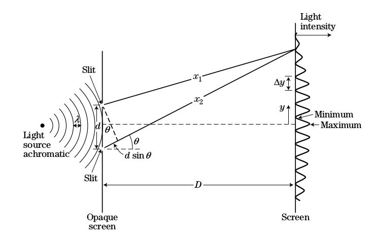
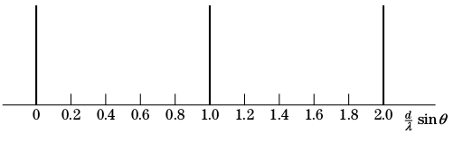

#Soal 1.
Perambatan Gelombang Elektromagnetik(EM) pada metal harus memperhatikan parameter dari medium antara lain permitivity ($\epsilon$), permeability ($\mu$) dan resistivity ($\eta$). Parameter resistivity metal dinyatakan dengan
$$\eta = \frac{m_e.v_e}{n_0 e^2}\ (\Omega.m)$$
dimana $m_e$ = massa elektron (kg), $n_0$ = kerapatan elektron ($m^{-3}$), $v_e$ = frekuensi tumbukan elektron ($s^{-1}$), e = muatan elektron (C).
Persamaan untuk gelombang E dinyatakan dalam
$$\frac{\partial^2E}{\partial x^2}=\epsilon\mu\frac{\partial^2E}{\partial t^2}+\frac{\mu}{\eta} \frac{\partial E}{\partial t}$$
Untuk kasus perambatan pada metal *diasumsikan* solusi persamaan gelombang adalah:

$$\mathbf{E(x,t)=A(x)sin(kx - \omega t)}$$

pada frekuensi tinggi diasumsikan faktor $\mu\epsilon\omega^2E\ <<\ \mu\omega E/\eta$ sehingga dapat disederhanakan menjadi persamaan difusi (*diffusion equation*).
1. Jika diasumsikan solusi persamaan difusi adalah $E(x,t)=A(x)sin(kx - \omega t)$ tentukan parameter dari A(x) yang memenuhi persamaan tersebut
2. Lanjutan pertanyaan 1.a, tentukan formulasi parameter **k** sebagai fungsi dari $\omega,\ \eta,\ \mu$ dan $\epsilon$ dari solusi persamaan tersebut
3. Tentukan *skin depth* sebagai fungsi dari $\omega,\ \eta,\ \mu$ dan $\epsilon$, serta makna fisis dari *skin depth* terkait perambatan gelombang EM pada metal terhadap frekuensi gelombang EM
4. Untuk material superkonduktor, dapat didekati bahwa parameter frekuensi tumbukan elektron ($s^{-1}$) mendekati nol (tidak terjadi tumbukan). Dari hasil parameter tersebut analisa kondisi *skin depth* untuk material superkonduktor

*petunjuk :*
$$\frac{\partial (A(x)sin(kx-\omega t))}{\partial t}=-\omega A(x)cos(kx-\omega t)$$
$$\frac{\partial (A(x)sin(kx-\omega t))}{\partial x}=\frac{dA}{dx}sin(kx-\omega t)+kA(x)cos(kx-\omega t)$$
Misalkan diasumsikan: $A(x)=A_0 e^{-\gamma x}$ dimana $\gamma$ adalah variabel bebas

#Soal 2.
Untuk membuat suatu lensa kaca mat tidak terjadi refleksi maka diperlukan lapisan tipis (*film*) dengan ketebalan tertentu. Tetapi syarat ini tidak mencukupi untuk menghasilkan anti refleksi secara maksimal. Jika $\Gamma_1$ dan $\Gamma_2$ adalah koefisien refleksi dari *air to film* dan *film to glass*. $(\Gamma_1 = \frac{1-n_f}{1+n_f}\ \ dan\ \ \Gamma_2 = \frac{n_f-n_g}{n_f+n_g})$

<b>Gambar 1</b>

1. Tentukan persyaratan nilai dari index refraksi dari film agar menghasilkan anti refleksi secara maksimal
Jika index refraksi dari gelas 1,5 serta cahaya yang datang adalah monochromatic dengan panjang gelombang 680 nm, tentukan:
2. Ketebalan dari coating pada kacamata
3. Tentukan indeks refraksi dari lapisan coating
4. Tentukan permitivitas dari bahan gelas yang digunakan

#Soal 3.
Suatu experimen berbasis konsep *Young* celah ganda digunakan untuk menentukan panjang gelombang ($\lambda$) sumber cahaya monochromatic. Jika beda fasa dinyatakan : $\phi = \frac{2 \pi}{\lambda}(x_2 - x_1)$, $(x_2 - x_1) = d sin\theta$ dengan asumsi sudut $\phi$ kecil.
1. Tentukan relasi antara jarak antara pola antara dua gelap pada $screen\ (\Delta y)$ terhadap jarak layar ke celah ganda, panjang gelombang sumber dan jarak antara celah ganda

<b>Gambar (a)</b>

2. Jika jarak antara celah adalah 0.1 mm dan jarak ke *screen* adalah 60 cm, tentukan besarnya panjang gelombang dari sumber
3. Berdasarkan evaluasi dari set experiment yang diberikan, berikan penjelasan singkat jenis difraksi yang digunakan (*Fressnel atau Fraunhofer)*
4. Jika dalam pengembangan eksperimen diinginkan pola gelap terang pada layar dari Gambar (b) menjadi (c), aspek apa yang harus dimodifikasi pada setting experiment

<b>Gambar (b)</b>

<b>Gambar (c)</b>

#Soal 4.
Salah satu masalah yang membuat citra bayangan tidak tajam pada lensa adalah *chromatic aberration*
1. Jelaskan singkat fenomena interaksi cahaya dengan lensa yang menyebabkan *chromatic aberration*
2. Jelaskan singkat solusi pada sistem lensa untuk mengatasi masalah tersebut

<b>Gambar 4</b>

