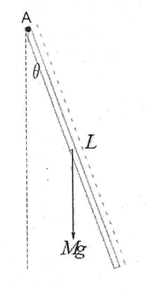
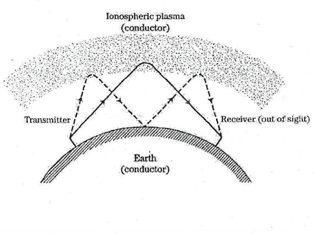
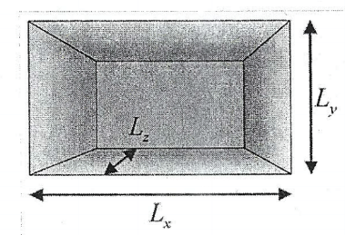
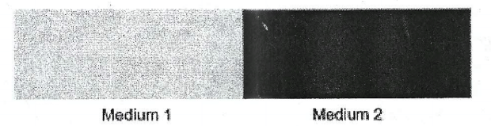

#Soal 1.
Diberikan suatu batang uniform dengan massa M (kg), dan panjang batang L(m) berayun pada poros A. Jika momen inersia (I) dari batang dengan poros A adalah $\frac{1}{3}ML^2$ dan batang berayun dengan sudut $\theta$ yang kecil, Tentukan

<b>Gambar 1</b>

1. Tentukan persamaan diferensial yang menyatakan gerak rotasional harmonik pada batang tersebut
2. Tentukan frekuensi osilasi dari ayunan batang tersebut

#Soal 2.
Gelombang elektromagnetik dalam ionospheric plasma memiliki relasi frekuensi gelombang($\omega$) etrhadap bilangan gelombang (k) dinyatakan dalam
$$\omega^2=\beta^2+c^2k^2$$
Dimana c adalah kecepatan cahaya dalam ruang hampa dan $\beta^2$ adalah konstanta frekuensi plasma, Tentukan

<b>Gambar 2</b>

1. Tentukan kecepatan phasa dari gelombang tersebut ($c_{ph}$)
2. Tentukan kecepatan group dari gelombang tersebut ($c_g$)
3. Berdasarkan relasi antara $c_{ph}$ dan $c_g$ berikan penjelasan tentang jenis medium dalam ionospheric plasma tersebut dan konsekuensi dari amplitudo gelombang yang merambat dari sumber menuju ke suatu lokasi penerima

#Soal 3.
1. Buktikan bahwa perubahan kecepatan suara $\Delta C_w$ disebabkan oleh perubahan temperatur yang kecil $\Delta T$ diberikan oleh
$$\Delta C_w = \frac{1}{2} \frac{\Delta T}{T} C_w$$
Dimana $C_w = \sqrt{\gamma RT/M_{mol}}$ adalah kecepatan pada kondisi STP (***hint* : untuk perubahan yang kecil suatu fungsi f(x), $\Delta f$ terhadap $\Delta x$, maka $\frac{df}{dx} \approx \frac{\Delta f}{\Delta x}$**
2. Berikan penjelasan singkat yang menjadi penyebab fenomena *shock wave*

#Soal 4.
Persamaan gelombang suara 3D dinyatakan dengan : $\frac{\partial^2 \xi(x,y,z,t)}{\partial^2 t} = C^2_w \nabla^2 \xi(x,y,z,t).$ Akan dianalisa standing wave yang terjadi pada suatu ruangan berbentuk kotak dengan dimensi $L_x, L_y,\ dan L_z$

<b>Gambar 3</b>

Jika persamaan gelombang berdiri dinyatakan dengan:
$$\xi(x,y,z,t)=sin(k_x x)sin(k_y y)sin(k_z z)cos(\omega t)$$
1. Tentukan persamaan frekuensi resonansi yang mungkin pada ruangan tersebut
2. Jelaskan bahwa dalam kondisi nyata suatu ruangan akustik harus dihindari terjadinya gelombang berdiri, berikan penjelasan secara singkat, dan jelaskan usaha yang dapat dilakukan untuk menghindari terjadinya gelombang berdiri tersebut

#Soal 5.
Jika $\xi_I, \xi_T,\ dan\ \xi_r$ adalah berturut-turut amplitudo "incident wave", "transmitted wave", dan "reflected wave", perbandingan amplitudo "incident wave", "transmitted wave", dan "reflected wave" dinyatakan dengan
$$\xi_r = \frac{Z_1 - Z_2}{Z_1 + Z_2} \xi_I \quad \xi_T = \frac{2Z_1}{Z_1 + Z_2} \xi_I$$

dimana Z adalah impedansi akustik dari medium.

<b>Gambar 4</b>

Jika gelombang merambat dari medium 1 (densitas $\rho_1$) ke medium 2 (densitas $\rho_2$). Jika incident wave dinyatakan dengan
$$I(x,t)=\xi_I e^{i(k_1 x-\omega_1 t)}$$
dan untuk "reflected wave" dan "transmitted wave" berturut-turut adalah
$$R(x,t)=\xi_r e^{i(k_2 x-\omega_2 t)}$$
$$T(x,t)=\xi_T e^{i(k_3 x-\omega_3 t)}$$
1. Berikan persyaratan pada *medium 2* agar amplitudo "reflected wave" sama dengan amplitudo "incident wave" tetapi dengan beda fasa yang berbeda $180\degree$. Jika kondisi ini terjadi nyatakan representasi gelombang $I(x,t),\ R(x,t),\ dan \ T(x,t)$
2. Jika densitas medium 2 adalah 75% dari densitas medium 1, tentukan perbandingan $\omega_2/\omega_1$ serta $\omega_3/\omega_1$
3. Jika diharapkan tidak terdapat "reflected wave", sebutkan persyaratan yang harus dipenuhi terkait perbandingan $\rho_1$ dan $\rho_2$ pada medium yang digunakan untuk perambatan gelombang tersebut, serta perbandingan $k_3/k_1$
4. Dalam satu kondisi khusus, gelombang berdiri dapat terjadi pada medium satu. Berikan persyaratan terkait dengan syarat impedansi akustik dari medium 1 dan medium 2, serta representasi dari $T(x,t)$ jika terjadi gelombang berdiri
